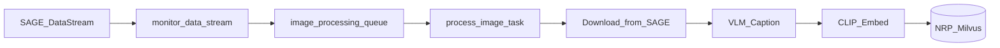
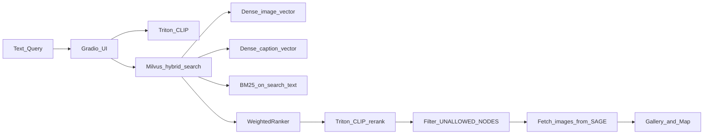

# Architecture

Sage Image Search is a microservice stack: ingestion pipelines write to NRP-managed Milvus, and the query UI reads from Milvus with help from Triton CLIP (embeddings and reranking).

## Indexing flow

New images from SAGE are detected, captioned, embedded, and stored in Milvus.



1. **Celery Beat** runs `monitor_data_stream` on a configurable interval (default 60 seconds).
2. The monitor queries the SAGE data stream for new `imagesampler` tasks since the last checkpoint.
3. Each image is enqueued to the `image_processing` Celery queue.
4. **process_image** downloads the image, generates a caption (Triton VLM or NRP AI Gateway), computes separate CLIP caption and image embeddings, and inserts the record into Milvus (`caption_vector`, `image_vector`, `search_text`, scalars — no image blob).

## Query flow

A text query is embedded, searched hybrid-style in Milvus, reranked with Triton CLIP, and displayed.



1. The user enters text in the Gradio UI.
2. Triton embeds the query text with CLIP.
3. Milvus runs `hybrid_search` with three requests — `image_vector`, `caption_vector`, and BM25 `sparse` — fused by `WeightedRanker(query_alpha * clip_alpha, query_alpha * (1 - clip_alpha), 1 - query_alpha)` (defaults: query_alpha=0.4, clip_alpha=0.7).
4. Triton CLIP (`DFN5B-CLIP-ViT-H-14-378`) re-scores each hit by query-text vs image similarity matching HF `logits_per_image` (L2-normalized cosine × `exp(logit_scale)` from the model).
5. Results from deny-listed nodes are filtered out.
6. Images are fetched from SAGE URLs and displayed in a gallery and map.

## Components

| Component | Role | Config location |
|-----------|------|-----------------|
| **Gradio UI** (`app/`) | Text search interface, gallery, map | [`kubernetes/base/gradio-ui.yaml`](../kubernetes/base/gradio-ui.yaml) |
| **Query engine** (`app/query.py`, `app/model.py`) | Milvus hybrid queries, Triton CLIP embed + CLIP rerank | [`app/HyperParameters.py`](../app/HyperParameters.py) |
| **Weavloader** (`weavloader/`) | Celery-based SAGE stream ingestion into Milvus | [`kubernetes/base/weavloader.yaml`](../kubernetes/base/weavloader.yaml) |
| **Weavmanage** (`weavmanage/`) | One-shot K8s Job for Milvus schema migrations | [`weavmanage/migrations/`](../weavmanage/migrations/) |
| **Triton** (`triton/`) | GPU inference: CLIP embeddings, Gemma-3 caption VLM | [`kubernetes/base/triton.yaml`](../kubernetes/base/triton.yaml) |
| **Milvus** | NRP-managed vector database (`milvus.nrp-nautilus.io:50051`) for Compose and Kubernetes | [NRP vector DB docs](https://nrp.ai/documentation/userdocs/ai/vector-database/) |
| **Redis** | Celery broker, DLQ, ingestion cursor (inside weavloader pod) | [`kubernetes/base/weavloader.yaml`](../kubernetes/base/weavloader.yaml) |

Model names and image tags change over time. Check the Kubernetes overlays for current deployment values:

- Dev: [`kubernetes/nrp-dev/`](../kubernetes/nrp-dev/)
- Prod: [`kubernetes/nrp-prod/`](../kubernetes/nrp-prod/)

## Service ports

| Service | Port(s) | Purpose |
|---------|---------|---------|
| Gradio UI | 7860 | Search web interface |
| Triton | 8000 (HTTP), 8001 (gRPC), 8002 (metrics) | Model inference |
| Weavloader metrics | 8080 | Prometheus metrics, health check |
| Flower | 5555 | Celery task monitoring (inside weavloader pod) |

## Milvus schema

Collections live in the NRP-provisioned database `MILVUS_DB=image_search_svc` (NRP admins create the DB; weavmanage only creates collections). Collection name via `MILVUS_COLLECTION` (defaults: prod/local `HybridSearchExample`, dev `HybridSearchExampleDev`), created by [`weavmanage/migrations/001_create_schema.py`](../weavmanage/migrations/001_create_schema.py):

- **Dense vectors:** `caption_vector` and `image_vector` FLOAT_VECTOR dim=1024 (CLIP text of the caption and CLIP image; COSINE / HNSW). Modalities are stored separately; `clip_alpha` weights them at query time. `fuse_embeddings()` remains in code for later experiments but is not used for indexing.
- **BM25:** `search_text` VARCHAR with analyzer → `sparse` via `FunctionType.BM25`
- **Time:** `timestamp` TIMESTAMPTZ (ISO 8601 on insert; stored as UTC; STL_SORT index)
- **Location:** `location` GEOMETRY (WKT `POINT(lon lat)`; RTREE index; `st_within` / `st_dwithin`)
- **Scalars:** caption, SAGE metadata fields
- **Not stored:** image/audio/video blobs (UI loads via SAGE `link`)

## Docker Compose vs Kubernetes

| Aspect | Docker Compose (local) | Kubernetes (NRP) |
|--------|------------------------|------------------|
| Vector DB | NRP managed Milvus (`MILVUS_URI` / `MILVUS_TOKEN` in `.env`) | Same NRP managed Milvus (`milvus-secret`) |
| Collection | `HybridSearchExample` (default) | Dev: `HybridSearchExampleDev`; Prod: `HybridSearchExample` |
| Active query path | `clip_hybrid_query` → hybrid_search + Triton CLIP rerank | Same |
| Caption backend | `LLM_RUN_MODE=TRITON` (default in `.env.example`) | `LLM_RUN_MODE=NRP` in overlays |
| GPU | Optional; Triton may need manual model download | GPU nodes for Triton |
| SAGE creds in UI | Via `SAGE_USER` / `SAGE_PASS` in Compose env | Set via K8s secrets |

## Kubernetes layout

```
kubernetes/
├── base/          # Core stack (Triton, Gradio, weavloader, weavmanage, secrets)
├── nrp-dev/       # Dev overlay (namePrefix: dev-, HybridSearchExampleDev)
├── nrp-prod/      # Prod overlay (namePrefix: prod-, HybridSearchExample)
└── prs/           # PR preview overlay
```

The weavloader pod runs multiple processes via supervisord: Redis, Celery beat, processor/moderator/cleaner workers, metrics server, and Flower.

## Future architecture

- A production UI in the beekeeper namespace (replacing Gradio)
- Search queries exposed through beehive-data-api (replacing direct Milvus access from `app/`)
- Per-user Sage ACL instead of static node deny lists

## Further reading

- [weavloader/README.md](../weavloader/README.md) — ingestion, Celery queues, DLQ, metrics
- [kubernetes/README.md](../kubernetes/README.md) — secrets, overlays, PR testing
- [Configuration](configuration.md) — environment variables and search tuning
