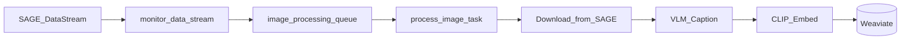
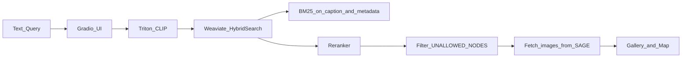

# Architecture

Sage Image Search is a microservice stack: ingestion pipelines write to Weaviate, and the query UI reads from Weaviate with help from Triton (embeddings) and a reranker service.

## Indexing flow

New images from SAGE are detected, captioned, embedded, and stored in Weaviate.



1. **Celery Beat** runs `monitor_data_stream` on a configurable interval (default 60 seconds).
2. The monitor queries the SAGE data stream for new `imagesampler` tasks since the last checkpoint.
3. Each image is enqueued to the `image_processing` Celery queue.
4. **process_image** downloads the image, generates a caption (Triton VLM or NRP AI Gateway), computes a CLIP embedding, and inserts the record into Weaviate.

## Query flow

A text query is embedded, searched hybrid-style in Weaviate, reranked, and displayed.



1. The user enters text in the Gradio UI.
2. Triton embeds the query text with CLIP.
3. Weaviate runs hybrid search (`target_vector=clip`, `alpha=0.4`) combining vector and BM25 keyword scores.
4. A cross-encoder reranker re-scores results on the `caption` property.
5. Results from deny-listed nodes are filtered out.
6. Images are fetched from SAGE URLs and displayed in a gallery and map.

## Components

| Component | Role | Config location |
|-----------|------|-----------------|
| **Gradio UI** (`app/`) | Text search interface, gallery, map | [`kubernetes/base/gradio-ui.yaml`](../kubernetes/base/gradio-ui.yaml) |
| **Query engine** (`app/query.py`, `app/model.py`) | Weaviate hybrid queries, Triton CLIP embeddings | [`app/HyperParameters.py`](../app/HyperParameters.py) |
| **Weavloader** (`weavloader/`) | Celery-based SAGE stream ingestion | [`kubernetes/base/weavloader.yaml`](../kubernetes/base/weavloader.yaml) |
| **Weavmanage** (`weavmanage/`) | One-shot K8s Job for Weaviate schema migrations | [`weavmanage/migrations/`](../weavmanage/migrations/) |
| **Triton** (`triton/`) | GPU inference: CLIP embeddings, Gemma-3 caption VLM | [`kubernetes/base/triton.yaml`](../kubernetes/base/triton.yaml) |
| **Weaviate** | Vector database, hybrid search, reranker integration | [`kubernetes/base/weaviate.yaml`](../kubernetes/base/weaviate.yaml) |
| **Reranker** | Cross-encoder re-scoring (`ms-marco-MiniLM-L-6-v2`) | [`kubernetes/base/reranker-transformers.yaml`](../kubernetes/base/reranker-transformers.yaml) |
| **Redis** | Celery broker, DLQ, ingestion cursor (inside weavloader pod) | [`kubernetes/base/weavloader.yaml`](../kubernetes/base/weavloader.yaml) |

Model names and image tags change over time. Check the Kubernetes overlays for current deployment values:

- Dev: [`kubernetes/nrp-dev/`](../kubernetes/nrp-dev/)
- Prod: [`kubernetes/nrp-prod/`](../kubernetes/nrp-prod/)

## Service ports

| Service | Port(s) | Purpose |
|---------|---------|---------|
| Gradio UI | 7860 | Search web interface |
| Weaviate | 8080 (HTTP), 50051 (gRPC), 2112 (metrics) | Vector database |
| Triton | 8000 (HTTP), 8001 (gRPC), 8002 (metrics) | Model inference |
| Reranker | 8080 | Cross-encoder reranking |
| Weavloader metrics | 8080 | Prometheus metrics, health check |
| Flower | 5555 | Celery task monitoring (inside weavloader pod) |

## Weaviate schema

The primary collection is `HybridSearchExample`, created by [`weavmanage/migrations/001_create_schema.py`](../weavmanage/migrations/001_create_schema.py):

- **Named vector:** `clip` (user-provided embeddings, not auto-vectorized)
- **Reranker:** transformers module on the `caption` property
- **Properties:** image blob, caption, SAGE metadata fields, geo `location`

## Docker Compose vs Kubernetes

These two deployment paths are **not identical**:

| Aspect | Docker Compose (local) | Kubernetes (NRP) |
|--------|------------------------|------------------|
| Vectorizer | `multi2vec-bind` (ImageBind) | User-provided CLIP vectors |
| Active query path | `clip_hybrid_query` in production K8s | Same in K8s; Compose may differ |
| Caption backend | `LLM_RUN_MODE=TRITON` (default in `.env.example`) | `LLM_RUN_MODE=NRP` in dev/prod overlays |
| GPU | Optional; Triton may need manual model download | GPU nodes for Triton and reranker |
| SAGE creds in UI | Not set by default in `docker-compose.yml` | Set via K8s secrets |

When developing locally, be aware that search behavior may differ from the NRP deployment.

## Kubernetes layout

```
kubernetes/
├── base/          # Core stack (Weaviate, Triton, reranker, Gradio, weavloader, weavmanage)
├── nrp-dev/       # Dev overlay (namePrefix: dev-)
├── nrp-prod/      # Prod overlay (namePrefix: prod-)
└── prs/           # PR preview overlay
```

The weavloader pod runs multiple processes via supervisord: Redis, Celery beat, processor/moderator/cleaner workers, metrics server, and Flower.

## Future architecture

- A production UI in the beekeeper namespace (replacing Gradio)
- Search queries exposed through beehive-data-api (replacing direct Weaviate access from `app/`)
- Per-user Sage ACL instead of static node deny lists

## Further reading

- [weavloader/README.md](../weavloader/README.md) — ingestion, Celery queues, DLQ, metrics
- [kubernetes/README.md](../kubernetes/README.md) — secrets, overlays, PR testing
- [Configuration](configuration.md) — environment variables and search tuning
